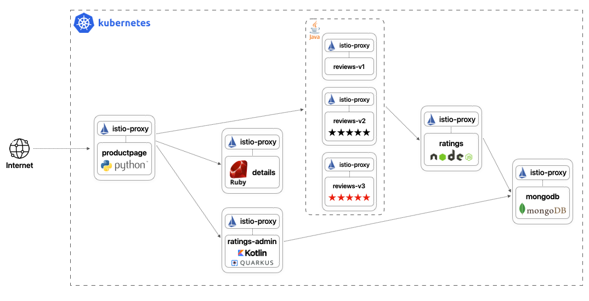

# CI/CD with the Istio Bookinfo sample

Final project for the subject MC523 SS21 at FH OÖ Campus Hagenberg based on the Istio sample application [bookinfo](https://github.com/istio/istio/tree/master/samples/bookinfo).

See: <https://istio.io/docs/examples/bookinfo/>

## 🏗 Architecture

The Bookinfo application is broken into four separate microservices:

| Service                            | Status                                                                                                                                                                                                                       | Quality                                                                                                                                                                                                  | Description                                                                                                |
|------------------------------------|------------------------------------------------------------------------------------------------------------------------------------------------------------------------------------------------------------------------------|----------------------------------------------------------------------------------------------------------------------------------------------------------------------------------------------------------|------------------------------------------------------------------------------------------------------------|
| [productpage](src/productpage)     | [](https://dev.azure.com/MC523-book-info/bookinfo/_build/latest?definitionId=5&branchName=main)     | [](https://sonarcloud.io/dashboard?id=ammerzon_bookinfo_productpage)   | The ``productpage`` microservice calls the ``details`` and ``reviews`` microservices to populate the page. |
| [details](src/details)             | [](https://dev.azure.com/MC523-book-info/bookinfo/_build/latest?definitionId=4&branchName=main)         | [](https://sonarcloud.io/dashboard?id=ammerzon_bookinfo_details)           | The ``details`` microservice contains book information.                                                    |
| [reviews](src/reviews)             | [](https://dev.azure.com/MC523-book-info/bookinfo/_build/latest?definitionId=3&branchName=main)         | [](https://sonarcloud.io/dashboard?id=ammerzon_bookinfo_reviews)           | The ``reviews`` microservice contains book reviews. It also calls the ``ratings`` microservice.            |
| [ratings](src/ratings)             | [](https://dev.azure.com/MC523-book-info/bookinfo/_build/latest?definitionId=2&branchName=main)         | [](https://sonarcloud.io/dashboard?id=ammerzon_bookinfo_ratings)           | The ``ratings`` microservice contains book ranking information that accompanies a book review.             |
| [ratings-admin](src/ratings-admin) | [](https://dev.azure.com/MC523-book-info/bookinfo/_build/latest?definitionId=6&branchName=main) | [](https://sonarcloud.io/dashboard?id=ammerzon_bookinfo_ratingsadmin) | The ``ratings-admin`` microservice offers an REST API to maintain the ratings.                             |
| [mongodb](src/mongodb)             | [](https://dev.azure.com/MC523-book-info/bookinfo/_build/latest?definitionId=1&branchName=main)         | [](https://sonarcloud.io/dashboard?id=ammerzon_bookinfo_mongodb)           | The ``mongodb`` service contains the database of the application.                                          |



## 📝 Requirements

- `docker`
- `istioctl`
- `kubectl`
- `skaffold`
- `minikube`

## 💻 Local deployment

1. Create a Minikube cluster

```bash
minikube start -p bookinfo --memory=4096
```

2. Install Istio
```bash
istioctl install --set profile=demo -y
```

> For further infos see: [Istio: Getting Started](https://istio.io/latest/docs/setup/getting-started/#install)

3. Deploy the services
```bash
pushd "src/ratings-admin"
  ./gradlew build -Dquarkus.package.type=native
popd
skaffold dev
```

4. Deploy additional services
```bash
kubectl apply -f platform/extras/jaeger.yaml
kubectl apply -f platform/extras/prometheus.yaml
kubectl apply -f platform/extras/kiali.yaml
kubectl apply -f platform/extras/grafana.yaml
```

> If there are errors trying to install the extras, try running the command again. There may be some timing issues which will be resolved when the command is run again.

5. Access the services
```bash
# database
minikube -p bookinfo -n bookinfo service --url mongodb
# frontend
minikube -p bookinfo -n bookinfo service --url productpage
```

## 🚀 Cloud deployment

```bash
pushd "src/ratings-admin"
  ./gradlew build -Dquarkus.package.type=native
popd
skaffold run  --default-repo <myrepo>
```

### Build docker images without pushing

```bash
skaffold build
```

### Push docker images to container registry

```bash
skaffold run --default-repo <myrepo>
```